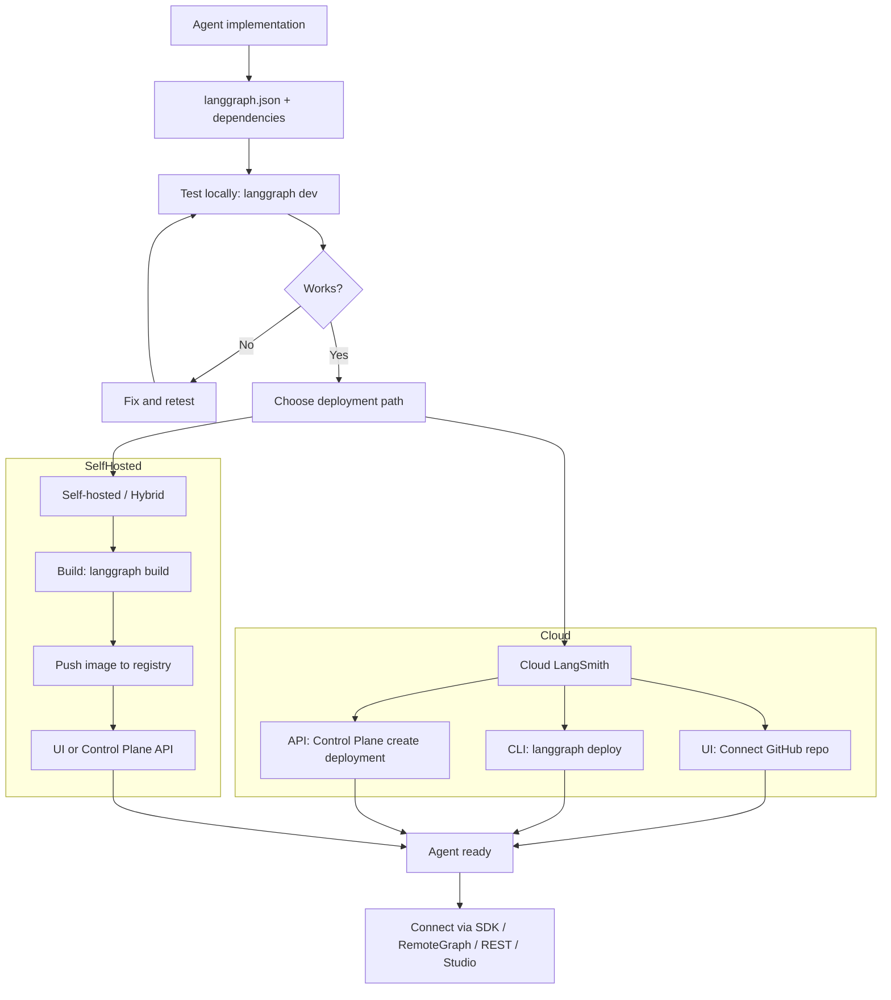

# LangSmith Deployments Workshop 🚀

A hands-on workshop for deploying agents to [LangSmith Deployment](https://docs.langchain.com/langsmith/deployments). This repo includes several agent examples built with [LangChain](https://docs.langchain.com/) and [LangGraph](https://docs.langchain.com/oss/python/langgraph/overview), plus examples for calling deployed agents via the [LangGraph SDK](https://docs.langchain.com/langgraph-platform/sdk) and [RemoteGraph](https://docs.langchain.com/langsmith/use-remote-graph).

## 🛠️ Prerequisites

- [uv](https://docs.astral.sh/uv/) — Fast Python package installer and resolver
- A [LangSmith account](https://smith.langchain.com/) (free to sign up)
- For Cloud deployment: a [GitHub account](https://github.com/) and repo (public or private)

## 🚀 Quick Start

### 1. Install Dependencies

```bash
uv sync
```

This creates a virtual environment and installs all project dependencies.

### 2. Environment Configuration

Copy the example environment file and add your keys:

```bash
cp .env.example .env
```

Edit `.env` and set at least:

- `OPENAI_API_KEY` or `ANTHROPIC_API_KEY` (for the agents)
- `LANGSMITH_API_KEY` (for tracing and deployment)
- `LANGSMITH_PROJECT` (optional; defaults to `langsmith-deployments-workshop`)

### 3. Run LangGraph Dev Server

Start the local LangGraph API server with Studio:

```bash
uv run langgraph dev
```

This starts the server (default port 2024) and opens [LangGraph Studio](https://docs.langchain.com/langsmith/studio), where you can run and debug the agents.

### 4. Run the advanced server (auth, store, custom HTTP)

To run the **advanced** setup with authentication, long-term memory store (semantic search), checkpointer TTL, custom HTTP app, and CORS:

```bash
uv run langgraph dev --config ./langgraph_advanced.json
```

This uses `langgraph_advanced.json`, which wires the **`langchain_advanced`** agent and the `advanced/` folder (auth, webapp). See [Advanced setup](#-advanced-setup) below.

## 📁 Project Structure

```
langsmith-deployments-workshop/
├── agents/                    # Agent implementations
│   ├── langchain_basic.py         # LangChain create_agent (calendar tools)
│   ├── langgraph_basic.py         # LangGraph StateGraph (calendar tools)
│   ├── langgraph_assistant.py     # Calendar + configurable model & system prompt (context)
│   ├── langchain_advanced.py      # Calendar + LTM (memories + documents), middleware, auth context
│   ├── langchain_remote_subagent.py   # Calendar subagent (make_graph + distributed tracing)
│   ├── langchain_remote_supervisor.py  # Supervisor with calendar as RemoteGraph tool
│   ├── deepagents_basic.py        # Deep Agents (planning, subagents)
│   └── utils.py                   # Shared model config
├── advanced/                  # Advanced config (used with langgraph_advanced.json)
│   ├── auth.py                    # Bearer-token auth + add_owner access control
│   ├── webapp.py                  # Custom async routes: GET /hello, POST /invoke (mounted at /api/v1)
│   └── sample_ltm_document.json  # Example document shape for store (user_id > documents)
├── examples/                  # How to call agents
│   ├── client_sdk.py             # LangGraph SDK (runs/stream)
│   └── remotegraph.py            # RemoteGraph (agent as subgraph)
├── langgraph.json             # Default LangGraph CLI config
├── langgraph_advanced.json    # Advanced config: auth, store, checkpointer, http, langchain_advanced
├── pyproject.toml
└── .env.example
```

## 🤖 Agents

All agents are wired in `langgraph.json` and exposed by the dev server:

| Graph ID                   | File                               | Description |
|----------------------------|------------------------------------|-------------|
| `langchain_basic`          | `agents/langchain_basic.py`        | Calendar assistant via LangChain `create_agent` with `read_calendar` and `write_calendar`. |
| `langgraph_basic`          | `agents/langgraph_basic.py`        | Same calendar tools and prompt, implemented as a LangGraph `StateGraph` with tool-calling loop. |
| `langgraph_assistant`      | `agents/langgraph_assistant.py`    | Calendar assistant with **configurable context**: `model_name` (`"openai"` \| `"anthropic"`, default openai) and optional `system_prompt` override. Studio can show a dropdown for model and pre-fill the default prompt. |
| `langchain_advanced`       | `agents/langchain_advanced.py`     | **Advanced config only**: calendar + **long-term memory** (memories + documents), pre-model middleware (inject preferences), `user_id` context. Use with `langgraph_advanced.json`. |
| `langchain_remote_subagent`| `agents/langchain_remote_subagent.py` | Calendar agent exposed via **make_graph** with **distributed tracing**: runs inside `ls.tracing_context` when a parent trace is present (e.g. when called by the supervisor). |
| `langchain_remote_supervisor` | `agents/langchain_remote_supervisor.py` | **Supervisor** agent with the calendar as a **tool**: uses a module-level **RemoteGraph** pointing at `langchain_remote_subagent`. Uses `distributed_tracing=True` so subagent runs appear under the same trace. |
| `deepagents_basic`         | `agents/deepagents_basic.py`       | Deep Agents calendar assistant with planning (todos) and subagent support. |

Use these graph IDs when calling the API (e.g. in `client_sdk.py` or RemoteGraph).

## Advanced setup

The **advanced** configuration (`langgraph_advanced.json`) adds authentication, a persistent store with semantic search, checkpointer TTL, and a custom HTTP app. Run it with:

```bash
uv run langgraph dev --config ./langgraph_advanced.json
```

### What `langgraph_advanced.json` enables

| Feature | Config key | Description |
|--------|------------|-------------|
| **Graph** | `graphs.langchain_advanced` | Single agent: `agents/langchain_advanced.py:agent`. |
| **Auth** | `auth.path` | `advanced/auth.py:auth` — Bearer-token auth; identity is used as `user_id` in context. |
| **Store** | `store` | Indexed store (e.g. `openai:text-embedding-3-small`, 1536 dims) for semantic search; TTL for expiry. |
| **Checkpointer** | `checkpointer` | TTL for thread checkpoints (e.g. delete after 43200 min). |
| **HTTP** | `http` | Custom app `advanced/webapp.py:app`, CORS, configurable headers, `mount_prefix` (e.g. `/api/v1`). |

### The `advanced/` folder

| File | Role |
|------|------|
| **`auth.py`** | **Auth** — `Auth()` and `@auth.authenticate`; validates `Authorization: Bearer <token>` against a toy `VALID_TOKENS` map and returns `identity` (e.g. `user1`, `user2`). `@auth.on` **add_owner** restricts access by owner unless the user is a Studio user. |
| **`webapp.py`** | **Custom HTTP app** — Async FastAPI routes mounted under `mount_prefix`; see [Custom routes](#custom-routes-webapp) below. |
| **`sample_ltm_document.json`** | **Sample LTM document** — Example JSON for a document you add manually to the store: namespace `(user_id, "documents")`, value with a `"document"` (or `"documents"`) key. Used by the **search_memory** tool. |

### Custom routes (webapp)

With `mount_prefix: "/api/v1"`, the custom app in `advanced/webapp.py` exposes these routes (all async, using the LangGraph SDK `get_client()` for in-process graph calls):

| Method | Path | Description |
|--------|------|-------------|
| **GET** | `/api/v1/hello` | Health-style endpoint; returns `{"Hello": "World"}`. |
| **POST** | `/api/v1/invoke` | Invokes the **`langchain_advanced`** graph with one user message and returns the assistant’s last message content. |

**POST /api/v1/invoke**

- **Body:** `{"message": "<user message>", "user_id": "<optional>"}`. If `user_id` is omitted, the handler uses the `x-user-id` header or `"default"`.
- **Headers:** Send `Authorization: Bearer <token>` (required when auth is enabled) and optionally `x-user-id` for context.
- **Response:** `{"content": "<assistant reply>", "graph_id": "langchain_advanced"}`. On graph failure returns **502** with a detail message.

**Example:** Run the advanced server, then call the custom invoke route:

```bash
uv run langgraph dev --config ./langgraph_advanced.json   # terminal 1
uv run python examples/invoke_advanced_agent.py           # terminal 2
```

`examples/invoke_advanced_agent.py` sends a POST to `http://localhost:2024/api/v1/invoke` with `Authorization: Bearer user1-token` and `x-user-id: user1`.

### The `langchain_advanced` agent (`agents/langchain_advanced.py`)

Calendar agent with **long-term memory (LTM)** and **per-user context**:

- **Context** — `Context(user_id: str)`. The server injects this (e.g. from auth `identity`); all store access is namespaced by `user_id`.
- **Tools**
  - **`read_calendar`** / **`write_calendar`** — Same as basic calendar (in-memory events).
  - **`search_memory`** — **Semantic search over the `documents` namespace**: `(user_id, "documents")`. Returns matching document content or `"No documents available."` if none. Use for user-added documents (see `advanced/sample_ltm_document.json`).
  - **`add_memory`** — Writes to the **`memories`** namespace: `(user_id, "memories")` with `{"memory": content}`. Used for preferences/facts the user wants the agent to remember.
- **Pre-model middleware** — **`inject_memory_preferences`** (async): before each model call, runs **`store.asearch`** on `(user_id, "memories")` and injects a **human message** like “Current user preferences: …” so the model sees stored preferences without a separate tool call.
- **Store layout** — Two namespaces per user:
  - **`(user_id, "memories")`** — Filled by `add_memory` and by the middleware; holds preferences/facts.
  - **`(user_id, "documents")`** — Filled manually (or by your own API); searched by **`search_memory`**.

**Calling the advanced API:** Send `Authorization: Bearer user1-token` (or `user2-token`) so the server sets context with that user’s `identity` as `user_id`. Use the graph ID **`langchain_advanced`** in requests.

**Adding documents:** Add items to the store with namespace `(user_id, "documents")`, key any string (e.g. `doc-001`), and value `{"document": "Your text content here."}`. See `advanced/sample_ltm_document.json` for the exact shape.

## 🚀 Deployment Options

You can deploy agents to LangSmith in several ways: from the **UI** (Cloud), with the **CLI** (`langgraph build` / `langgraph deploy`), or via the **Control Plane API** (e.g. for CI/CD or custom registries).

### Prerequisites for Deployment

Before deploying, ensure you have:

1. **A runnable graph** — e.g. `./agents/langgraph_basic.py:agent` (or any entry in `langgraph.json`).
2. **Dependencies** — This project uses `pyproject.toml`; the config points to `"."` so the CLI installs the current package.
3. **Configuration** — `langgraph.json` at the repo root with:
   - `graphs`: map of graph ID → module path (e.g. `"langgraph_basic": "./agents/langgraph_basic.py:agent"`).
   - `dependencies`: e.g. `["."]`.
   - `env`: path to `.env` or env mapping.
   - Optional: `python_version`, `image_distro`, etc.

Example `langgraph.json` (from this repo):

```json
{
    "graphs": {
        "langchain_basic": "./agents/langchain_basic.py:agent",
        "langgraph_basic": "./agents/langgraph_basic.py:agent",
        "langgraph_assistant": "./agents/langgraph_assistant.py:agent",
        "deepagents_basic": "./agents/deepagents_basic.py:agent",
        "langchain_remote_subagent": "./agents/langchain_remote_subagent.py:make_graph",
        "langchain_remote_supervisor": "./agents/langchain_remote_supervisor.py:agent"
    },
    "env": ".env",
    "python_version": "3.11",
    "dependencies": ["."],
    "image_distro": "wolfi"
}
```

### Method 1: LangSmith Deployment UI (Cloud)

Deploy from the LangSmith UI by connecting a GitHub repository:

1. Open [LangSmith](https://smith.langchain.com/) → **Deployments**.
2. Click **+ New Deployment**.
3. **Import from GitHub** and authorize the `hosted-langserve` GitHub app (one-time per org/account).
4. Choose the repo and branch, and set:
   - **Config path**: e.g. `langgraph.json` (path from repo root).
   - **Deployment type**: Development or Production.
   - **Name**, and optionally **Shareable through Studio**.
5. Configure **Environment variables and secrets** (e.g. `OPENAI_API_KEY`, `LANGSMITH_API_KEY`).
6. Submit; the deployment is built and run from the linked branch.

**Benefits:** No Docker or CLI on your machine; automatic updates on push to the branch (if enabled).  
See [Deploy to Cloud](https://docs.langchain.com/langsmith/deploy-to-cloud) and [Deployment quickstart](https://docs.langchain.com/langsmith/deployment-quickstart).

### Method 2: LangGraph CLI (Build & Deploy)

Use the CLI to build a Docker image and optionally deploy it.

**Local build:**

```bash
# Build Docker image
uv run langgraph build -t my-agent:latest

# Push to your container registry (Docker Hub, ECR, GCR, ACR, etc.)
docker push my-agent:latest
```

**Deploy to LangSmith Cloud in one step:**

```bash
# Build and deploy to LangSmith (uses LANGGRAPH_HOST_API_KEY or LANGSMITH_API_KEY from .env)
uv run langgraph deploy

# With options
uv run langgraph deploy --name my-calendar-agent
uv run langgraph deploy --deployment-id <existing-id>   # Update existing deployment
```

`langgraph deploy` builds the image, pushes it to a managed registry, and creates/updates the deployment. See [LangGraph CLI — deploy](https://docs.langchain.com/langsmith/cli#deploy).

**When to use:** You want a single command from your machine to Cloud, or you already build images and want to push to a registry and then use the Control Plane API or UI.

### Method 3: Control Plane API

For automation (CI/CD, custom tooling), use the [Control Plane API](https://docs.langchain.com/langgraph-platform/api-ref-control-plane) to create and manage deployments.

- **Cloud:** Create deployments from GitHub (e.g. `source: "github"`) or from a Docker image (e.g. after `langgraph build` and push to a registry).
- **Self-hosted / Hybrid:** Create deployments with `source: "external_docker"` and your image URI.

Example flow:

1. **Create deployment:** `POST /v2/deployments` with the right `source` and `source_config` (and optional `source_revision_config`, `secrets`).
2. **Poll revision status:** `GET /v2/deployments/{deployment_id}/revisions/{revision_id}` until status is `DEPLOYED`.

Authentication uses headers such as `X-Api-Key` (LangSmith API key) and `X-Tenant-Id` (workspace ID). See the [Control Plane API reference](https://docs.langchain.com/langgraph-platform/api-ref-control-plane) and [Create Deployment](https://docs.langchain.com/api-reference/deployments-v2/create-deployment).

### Local Development & Testing

Always validate the graph locally before deploying:

```bash
uv run langgraph dev
```

This will:

- Start the LangGraph API server (default port 2024).
- Open LangGraph Studio so you can run the graph and inspect state.
- Use your local `langgraph.json` and `.env`.

If the graph works in Studio, deployment to LangSmith will usually succeed. See [LangGraph CLI — dev](https://docs.langchain.com/langsmith/cli#dev).

**Supervisor + subagent (same deployment):** The `langchain_remote_supervisor` graph calls `langchain_remote_subagent` in-process (same server). With a **single worker**, that can **deadlock**: the supervisor run blocks waiting for the calendar tool, while the subagent run is queued on the same worker and never starts. Run the dev server with at least two jobs per worker so the subagent run can execute while the supervisor is waiting:

```bash
uv run langgraph dev --n-jobs-per-worker 2
```

In production you typically have multiple workers, so this in-process pattern does not deadlock.

### Connect to Your Deployed Agent

Once deployed, you can use the deployment URL (and API key if required) with:

- **[LangGraph SDK](https://docs.langchain.com/langgraph-platform/sdk)** — `get_client` / `get_sync_client` and `client.runs.stream(...)` (see `examples/client_sdk.py`; change `url` and use your deployment URL).
- **[RemoteGraph](https://docs.langchain.com/langsmith/use-remote-graph)** — Use the deployed graph as a node in another graph (see `examples/remotegraph.py`; set `url` to your deployment URL).
- **[REST API](https://docs.langchain.com/langgraph-platform/server-api-ref)** — HTTP calls to `/runs/stream`, `/threads`, etc.
- **[LangGraph Studio](https://docs.langchain.com/langsmith/studio)** — Open the deployment in Studio from the LangSmith UI (if the deployment is shareable or you have access).

### Environment Configuration

- **Secrets:** Set `OPENAI_API_KEY`, `ANTHROPIC_API_KEY`, and other keys as **secrets** in the deployment (UI or API), not as plain env vars.
- **LangSmith:** `LANGSMITH_TRACING`, `LANGSMITH_PROJECT`, etc. can be set in the deployment so traces go to your project.
- **Database/cache:** For advanced setups, see [environment variables](https://docs.langchain.com/langgraph-platform/env-var) (e.g. custom Postgres/Redis).

### Deployment Flow



### Deployment Best Practices

1. **Test locally first** — Run `langgraph dev` and verify the graph in Studio.
2. **Version images** — Use explicit tags (e.g. `my-agent:v1.2.0`) when building with `langgraph build`.
3. **Use secrets for keys** — Never commit API keys; configure them as deployment secrets.
4. **Monitor** — Use [LangSmith observability](https://docs.langchain.com/langsmith/observability) (traces, dashboards, alerts) for deployed agents.

## 📚 Examples

- **`examples/client_sdk.py`** — Calls an agent (e.g. `langchain_basic`) via the LangGraph SDK with a threadless run and streaming. Point `url` at your deployment to test a deployed agent.
- **`examples/remotegraph.py`** — Composes a parent graph that calls a child graph via `RemoteGraph`; change `url` and `graph_name` to use a deployed graph.
- **`examples/invoke_advanced_agent.py`** — Calls the **advanced** server’s custom route `POST /api/v1/invoke` with auth and `x-user-id`; use with `langgraph dev --config ./langgraph_advanced.json` (see [Custom routes](#custom-routes-webapp)).
- **Supervisor + subagent** — Run the `langchain_remote_supervisor` graph in Studio (or via SDK). It delegates calendar tasks to `langchain_remote_subagent` via a tool. Use `langgraph dev --n-jobs-per-worker 2` so the in-process subagent call does not deadlock (see [Local Development & Testing](#local-development--testing)).

Run against the local dev server:

```bash
uv run langgraph dev   # in one terminal (use --n-jobs-per-worker 2 for supervisor)
uv run python examples/client_sdk.py
uv run python examples/remotegraph.py
```

## 📖 Documentation

- [LangSmith Deployment](https://docs.langchain.com/langsmith/deployments) — Overview and concepts
- [Deploy to Cloud](https://docs.langchain.com/langsmith/deploy-to-cloud) — Full Cloud setup
- [Deployment quickstart](https://docs.langchain.com/langsmith/deployment-quickstart) — First deployment from GitHub
- [LangGraph CLI](https://docs.langchain.com/langsmith/cli) — `langgraph dev`, `build`, `deploy`
- [LangGraph CLI — deploy](https://docs.langchain.com/langsmith/cli#deploy) — One-step deploy to LangSmith
- [Control Plane API](https://docs.langchain.com/langgraph-platform/api-ref-control-plane) — Create and manage deployments programmatically

## 📄 License

This project is licensed under the MIT License — see the [LICENSE](LICENSE) file for details.
